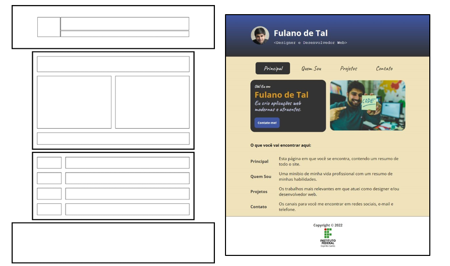
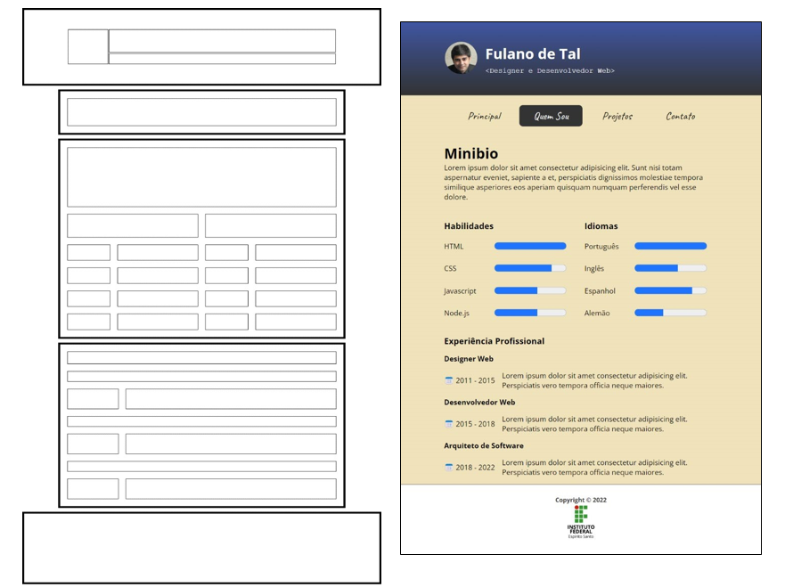
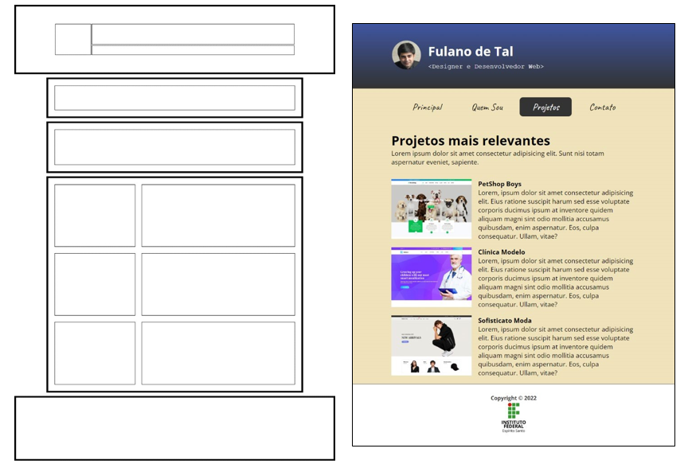
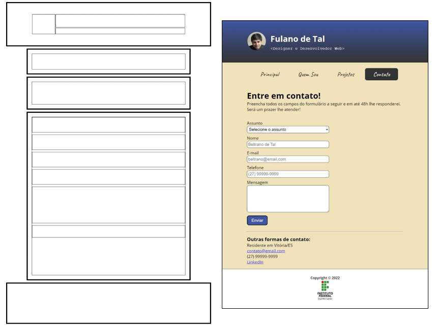
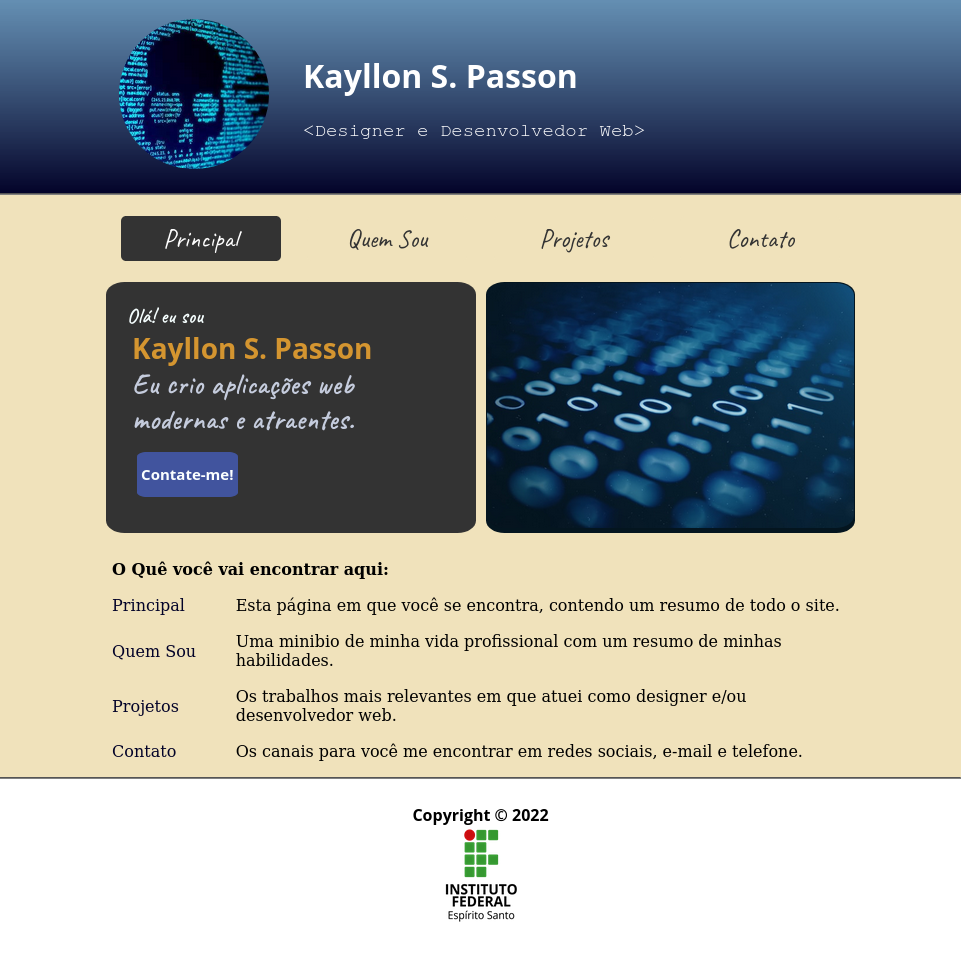
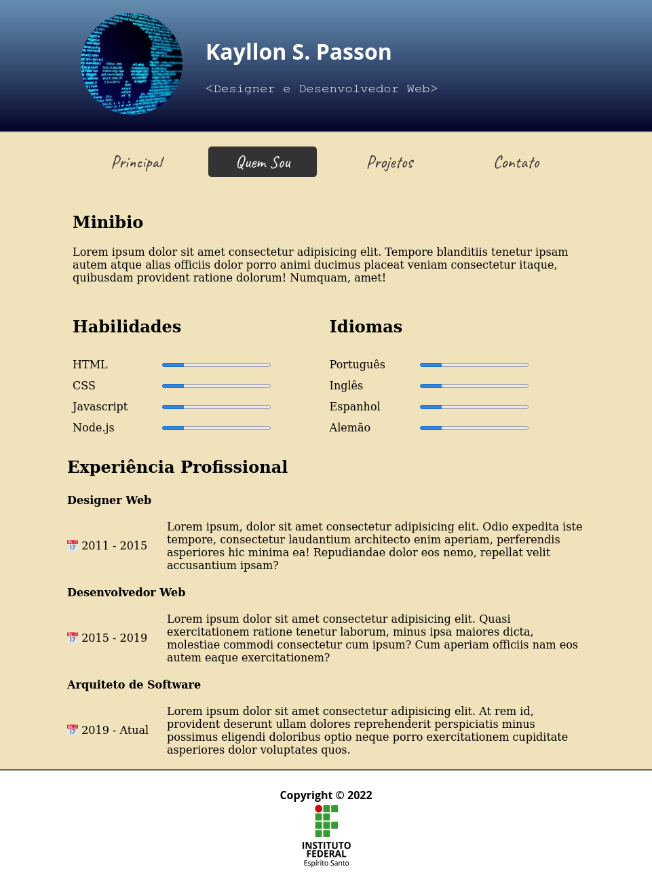
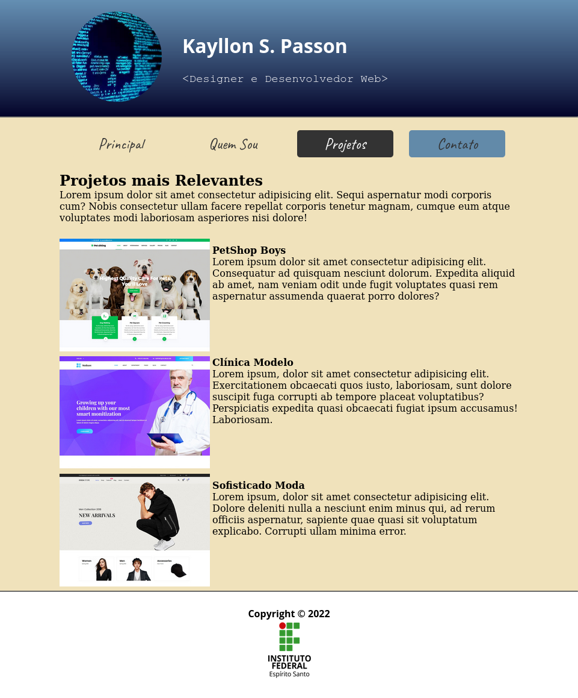
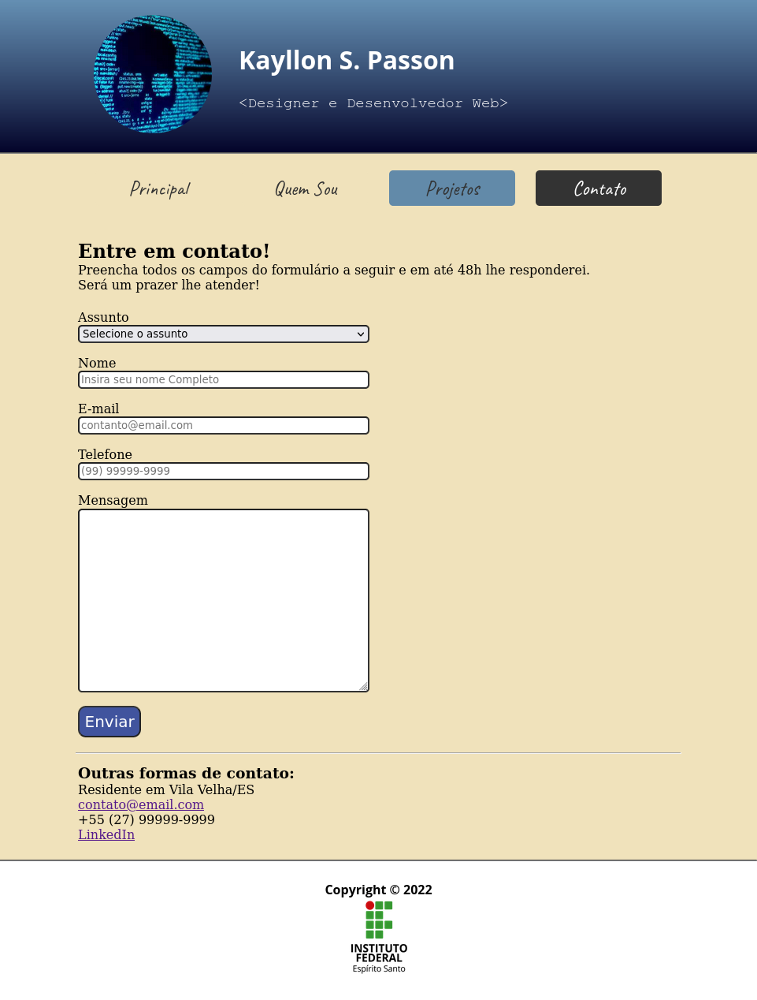

# Atividade Prática da Semana 2

## Instruções

Na semana anterior, você fez um site de portfólio com 4 páginas usando somente HTML e imagens. Agora que você avançou nos estudos de HTML e já iniciou os estudos de CSS, nós vamos aprimorar o site construído na semana 1. Mas antes de colocarmos a mão na massa, vamos a algumas considerações importantes. Uma das questões mais complicadas ao se fazer um site construído com HTML puro é a criação do leiaute da página, ou seja, a divisão da página em regiões. Há muitos anos, a técnica mais comum para se dividir uma página em regiões era através do uso de tabelas HTML.
   
Entretanto, nas últimas duas décadas, o leiaute tableless, ou seja, sem o uso de tabelas, é o que tem sido adotado pelos web designers, por apresentar vantagens relevantes em relação ao leiaute com tabelas. Porém, para se construir um leiaute tableless precisamos de conhecimentos que só aprenderemos nas próximas duas semanas. Na tarefa desta semana, nós voltaremos no tempo e recriaremos o site de portifólio usando o preterido leiaute baseado em tabelas. 

As figuras das páginas a seguir apresentam as capturas de tela das páginas do site de portfólio aprimorado com CSS e usando o leiaute baseado em tabelas. As figuras da esquerda indicam as tabelas utilizadas para se definir as regiões de conteúdo e as figuras da direita mostram as respectivas páginas já com o conteúdo formatado inserido nas células das tabelas. Nas figuras da esquerda, as regiões com bordas mais espessas correspondem a tabelas. Portanto, a primeira página tem 4 tabelas e as outras 3 páginas têm 5 tabelas cada. Só mais uma observação! Ignore o fato de as figuras da esquerda estarem ligeiramente mais longas do que suas correspondentes da direita. Isso aconteceu porque eu inseri uma margem inferior em todas as tabelas para que elas pudessem estar ligeiramente separadas umas das outras para facilitar a identificação. 

Agora vamos à tarefa. Com base nas informações visuais das figuras apresentadas nas páginas seguintes, você deve recriar o site de portfólio da primeira semana para que ele fique visualmente o mais semelhante possível do que é apresentado nas figuras a seguir. As imagens utilizadas para a criação do site podem ser baixadas junto ao enunciado da questão em nossa sala virtual. Para concluir, enquanto estiver criando este site, atente-se para as valiosas dicas a seguir: 

1)	As fontes usadas foram a Caveat, Open Sans e Courier New. As duas primeiras podem ser obtidas no Google Fonts e a terceira já é suportada nativamente pelos navegadores. 
2)	Os itens de menu são links para as respectivas páginas “index.html”, “quemsou.html”, “projetos.html” e “contato.html”. Mantenha esses nomes nos arquivos das páginas. 
3)	Os itens de menu e o botão da seção em destaque da página principal tiveram sua propriedade CSS display alterada para inline-block. 
4)	O plano de fundo degradê do cabeçalho foi criado a partir da propriedade CSS background-image com o valor definido pela função CSS linear-gradient(cor1, cor2). 
5)	As propriedades CSS border-collapse e border-spacing podem ser utilizadas para se definir o espaçamento entre as células de uma tabela. 
6)	Em algumas células de tabela, é importante configurá-las para que tenham a largura de seu conteúdo e para impedir a quebra de linha no caractere de espaço. Isso pode ser conseguido aplicando-se a seguinte formatação CSS: { width: 1%; white-space: nowrap; } . 
7)	Para definir os tamanhos dos elementos, considere uma largura de tela de 1280px. Neste site, o cabeçalho e o rodapé possuem essa largura, ou seja, ocupam 100% da largura disponível. As demais regiões (com linhas grossas) ocupam 80% da largura da página e estão centralizadas. 

Agora que você já leu as dicas, abra o editor de código e mãos à obra! 

#### Capturas de Tela das Páginas do Site a Ser Criado 

  
Prévias

