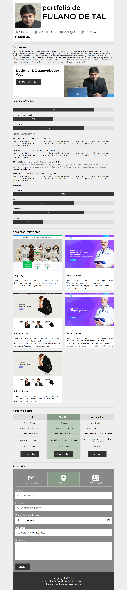

# Atividade Prática da Semana 4  

Na atividade prática da semana 3, você finalizou a criação de um site de portfólio do tipo *página única*! Na atividade da semana 4, o foco será na responsividade. Você está recebendo o código-fonte do site de portfólio pessoal com responsividade semiacabado. Assim como na semana anterior, sua tarefa será concluí-lo. Sua primeira tarefa é transferir os seus dados pessoais para esse site, conforme fez na tarefa anterior, substituindo os conteúdos pessoais fictícios. Em seguida, você deverá abrir o arquivo "estilos.css" e completar os seletores CSS nos trechos comentados usando as proprieades adequadas para o que é pedido.

Para começar, selecione o arquivo "index.html" e clique no botão "Run" no cabeçalho para visualizar a renderização da página no navegador incorporado do Repl.it. Depois disso, insira seus dados pessoais e em seguida selecione o arquivo "estilos.css" para comece a trabalhar nele. Enquanto estiver fazendo as alterações no código CSS, você pode pressionar "Ctrl+S" para aplicá-las à visualização do arquivo "index.html". Faça isso a cada alteração e observe o impacto causado. Isso te ajudará a compreender a utilidade de cada uma das propriedades CSS que estão sendo trabalhadas. Para concluir, não deixe também de assistir ao vídeo de apresentação dessa atividade, pois ele tem dicas valiosas. A figura abaixo mostra duas visões da versão responsiva do site já concluído. Bons estudos!

## Site Pronto em Tela Estreita ( <= 1280px de largura )



<hr>

## Site Pronto em Tela Larga


<details>
  <summary>Gabarito</summary>

```css
/* 1. Configurações CSS para telas de até 1280px */
@media screen and (max-width: 1280px) {

/* 2. Posicionamento estático */
position: static;
  
/* 3. Largura de 80% da largura área de visualização */
width: 80vw;

/* 4. Altura automática */
height: auto;

/* 5. Contêiner flexbox */
display: flex;
  
/* 6. Espaço de 1rem entre itens flexbox */
gap: 1rem;

/* 7. Contêiner flexbox */
display: flex;
  
/* 8. Espaço de 3vw entre itens flexbox */
gap: 3vw;

/* 9. Largura de 2.5% da largura área de visualização */
width: 2.5vw;
  
/* 10. Margem direita de 0.6% da largura área de visualização */
margin-right: .6vw;

/* 11. Tamanho de fonte de 2.5% da largura área de visualização */
font-size: 2.5vw;

/* 12. Alinhamento vertical superior */
vertical-align: top;
  
/* 13. Margens zeradas (forçar) */
margin: 0 !important;
  
/* 14. Ocultar elemento */
display: none;

/* 15. Mostrar elemento */
display: show;

/* 16. Posicionamento estático */
position: static;
  
/* 17. Margem interna superior de 0.5rem */
padding-top: .5rem;

/* 18. Grid de duas colunas iguais */
grid-template-columns: 1fr 1fr;

/* 19. Altura automática (forçar) */
height: auto !important;

/* 20. Largura de 50% do pai, menos 0.75rem */
width: calc(50% - 0.75rem);

```

</details>