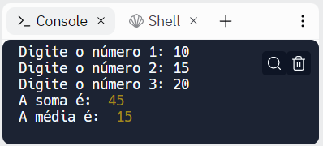
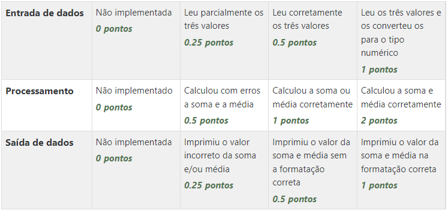
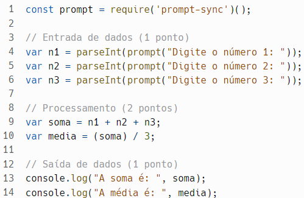

# Prática da Semana 1
  
Elabore um algoritmo que receba três números e ao final imprima na tela, a soma dos três números e a média dos três números.

  ## Exemplo de execução do programa
  
  

  

  
Grade de correção e Gabarito

  ## Grade de correção
  

   ## Gabarito
  
  
  
  

  ## Objetivos de aprendizagem
  1. Declarar variáveis
  2. Utilizar operadores
  3. Utilizar comandos de entrada e saída de dados
  

  