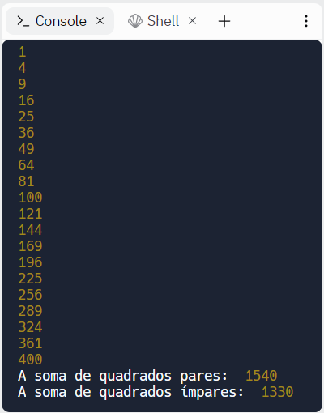
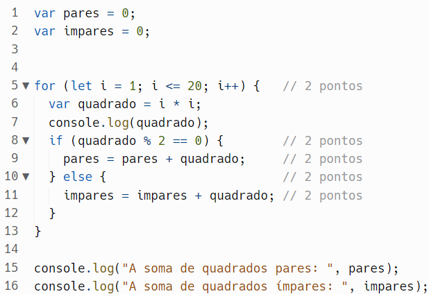
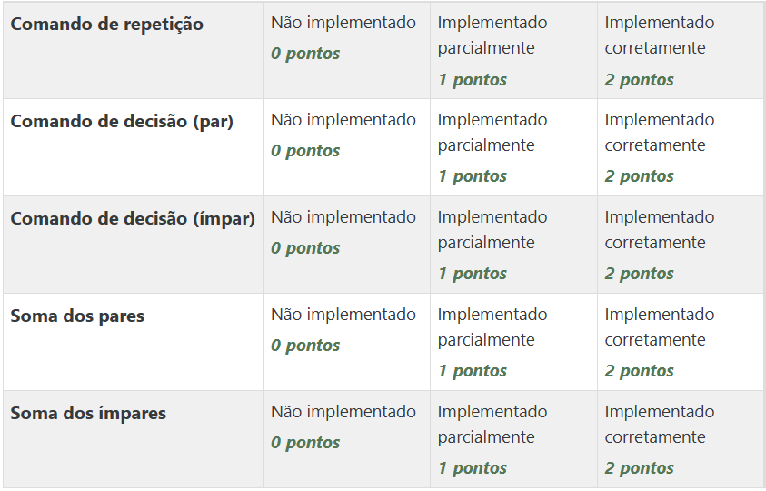

# Prática da Semana 3
  
Número quadrado, em matemática, é um inteiro que pode ser escrito como o quadrado de outro número inteiro. Ou ainda se a raiz quadrada de um número inteiro for outro inteiro, o primeiro é um número quadrado.

Exemplos de números quadrados: 12 = 1; 22 = 4; 32 = 9; 42 = 16

Faça um algoritmo para mostrar os 20 primeiros números quadrados.

Também informe no final, a soma dos quadrados pares e a soma dos quadrados ímpares.

## Exemplo de execução do programa
  

    
Grade de correção e Gabarito

# Gabarito

## Grade de correção

## Objetivos de aprendizagem
1. Utilizar comandos de repetição
2. Utilizar comandos de decisão 