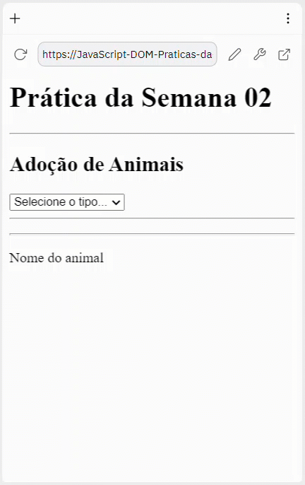
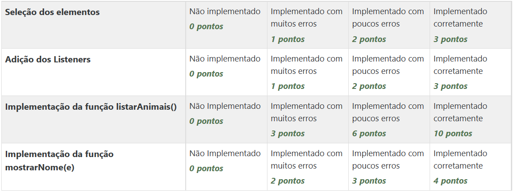

# Prática da Semana 2
  
Elabore um código no arquivo script.js para implementação de eventos relacionados a uma página index.html.

No seu código você deve implementar funções para:

* listar as imagens dos animais (de acordo com a espécie de animal selecionada - cachorro ou gato) após o usuário escolher a opção no elemento select;
* exibir o nome do animal após o usuário passar com o mouse na área da imagem do animal;

## Exemplo de execução do programa
  

  

    
Grade de correção

## Grade de correção

  

## Objetivos de aprendizagem
1. Utilizar manipuladores de eventos JavaScript DOM
  

  

